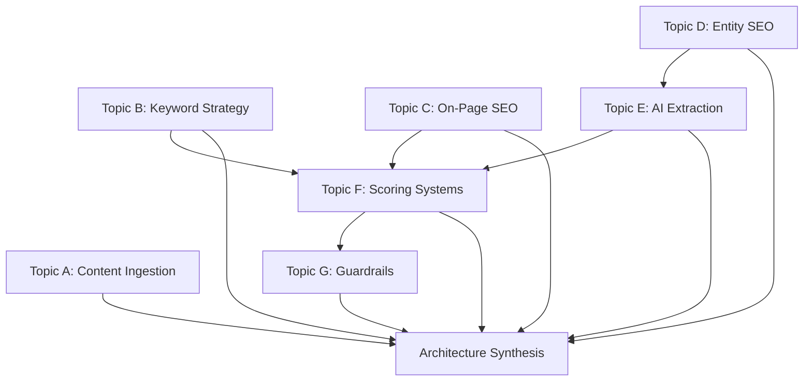

# Research Plan - SEO + AI Content Optimization Tool

## Executive Summary

This document outlines the research plan for building a comprehensive SEO and AI content optimization tool. The research phase will produce seven detailed technical documents covering content ingestion, keyword strategy, on-page SEO, entity-based SEO, AI content extraction, scoring systems, and safety guardrails, culminating in an architecture synthesis.

## Research Sequence & Dependencies



### Dependency Analysis

| Topic | Dependencies | Can Run Parallel With |
|-------|--------------|----------------------|
| A: Content Ingestion | None | B, C, D |
| B: Keyword Strategy | None | A, C, D |
| C: On-Page SEO | None | A, B, D |
| D: Entity SEO | None | A, B, C |
| E: AI Extraction | D (partial) | A, B, C |
| F: Scoring Systems | B, C, E (inputs) | A, D, G (partial) |
| G: Guardrails | F (scoring thresholds) | A, B, C, D |
| Synthesis | All topics | None |

### Recommended Execution Order

**Phase 1a (Parallel):** Topics A, B, C, D
**Phase 1b (Parallel):** Topics E, F (can start once D provides entity context)
**Phase 1c:** Topic G (requires F for scoring thresholds)
**Phase 2:** Architecture Synthesis

## Research Depth Estimates

| Topic | Estimated Depth | Key Deliverables |
|-------|-----------------|------------------|
| A: Content Ingestion | High | Library comparison matrix, AST schema, chunking algorithm |
| B: Keyword Strategy | High | Intent classification framework, clustering algorithm specs |
| C: On-Page SEO | Medium | Rule definitions, threshold values, validation logic |
| D: Entity SEO | High | NER pipeline spec, authority scoring formula, KB integration |
| E: AI Extraction | High | Structural signal rules, RAG optimization patterns |
| F: Scoring Systems | Very High | Composite scoring formula, threshold calibration, examples |
| G: Guardrails | Medium | Detection rules, intervention thresholds, rollback spec |

## Key Decision Points Requiring Stakeholder Input

### Critical Decisions

1. **Internal Representation Format**
   - Options: Custom AST, JSON-LD, Unified.js-compatible tree
   - Impact: Affects all downstream processing
   - Recommendation deferred until Topic A research complete

2. **Entity Knowledge Base Integration**
   - Options: Wikipedia API, Wikidata SPARQL, Custom ontology, None
   - Impact: Entity authority scoring accuracy
   - Cost implications: API limits, local storage requirements

3. **Scoring Weight Distribution**
   - Options: Fixed weights, Configurable weights, ML-learned weights
   - Impact: User customization vs. consistency
   - Requires: Topic F research to define base metrics first

4. **Optimization Aggressiveness Levels**
   - Options: Conservative (safety-first), Balanced, Aggressive (max SEO)
   - Impact: User trust, factual preservation
   - Requires: Topic G research to define safety boundaries

### Secondary Decisions

5. **Real-time API Integration**
   - Google Search Console, Ahrefs/SEMrush APIs for live SERP data
   - Impact: Feature scope, external dependencies, costs

6. **AI Model for Optimization Suggestions**
   - Options: Local LLM, OpenAI API, Claude API, Hybrid
   - Impact: Latency, cost, quality, privacy

## Document Naming Convention

```
docs/research/
├── 00-research-plan.md          # This document
├── 01-content-ingestion.md      # Topic A
├── 02-keyword-strategy.md       # Topic B
├── 03-onpage-seo-framework.md   # Topic C
├── 04-entity-seo.md             # Topic D
├── 05-ai-content-extraction.md  # Topic E
├── 06-scoring-systems.md        # Topic F
├── 07-guardrails.md             # Topic G
└── 08-architecture-synthesis.md # Final synthesis
```

## Success Criteria for Research Phase

### Per-Document Requirements

- [ ] Executive summary present (2-4 paragraphs)
- [ ] All research questions addressed with rationale
- [ ] Library/tool comparisons use decision matrix format
- [ ] Scoring formulas include worked examples
- [ ] Success metrics are measurable and specific
- [ ] No implementation code included
- [ ] Open questions explicitly flagged

### Phase Completion Criteria

- [ ] All 7 topic documents complete
- [ ] Architecture synthesis integrates all findings
- [ ] Data flow diagrams in Mermaid format
- [ ] Risk assessment completed
- [ ] Implementation priority matrix defined
- [ ] active_context.md updated with decisions and next phase

## Timeline Structure

This research phase produces documentation only. No code will be written. Each topic document will be comprehensive and self-contained, suitable for conversion to engineering tickets in the implementation phase.

---

*Document Version: 1.0*
*Created: 2026-01-16*
*Status: Active*
