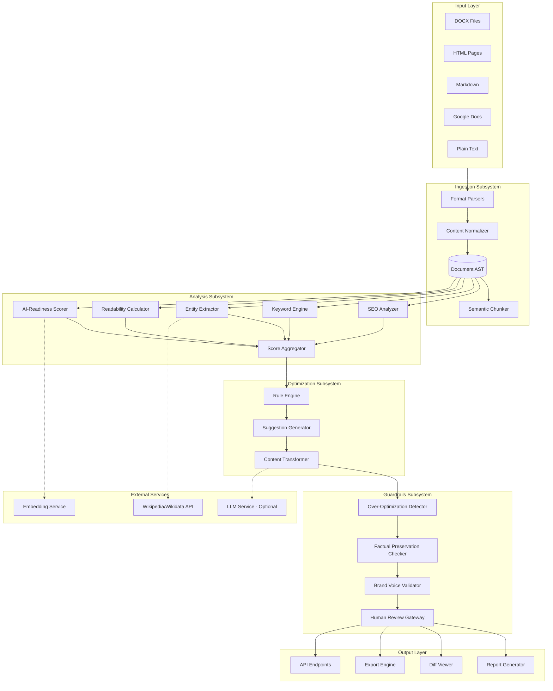
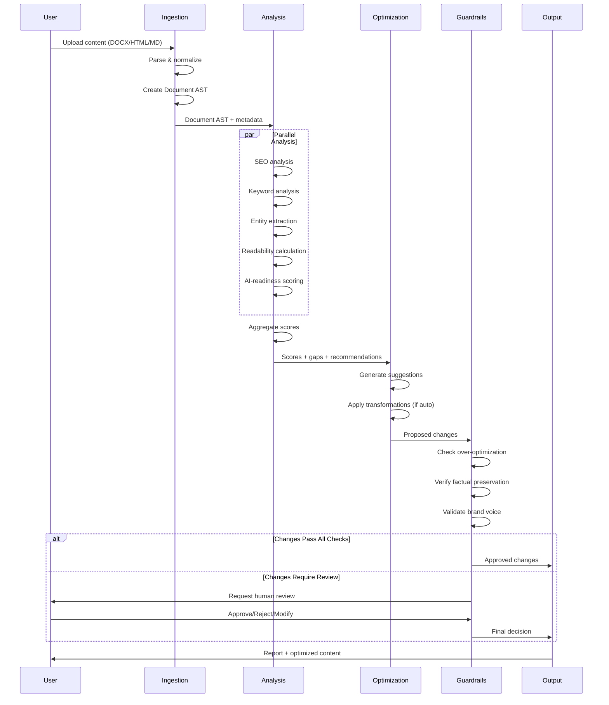
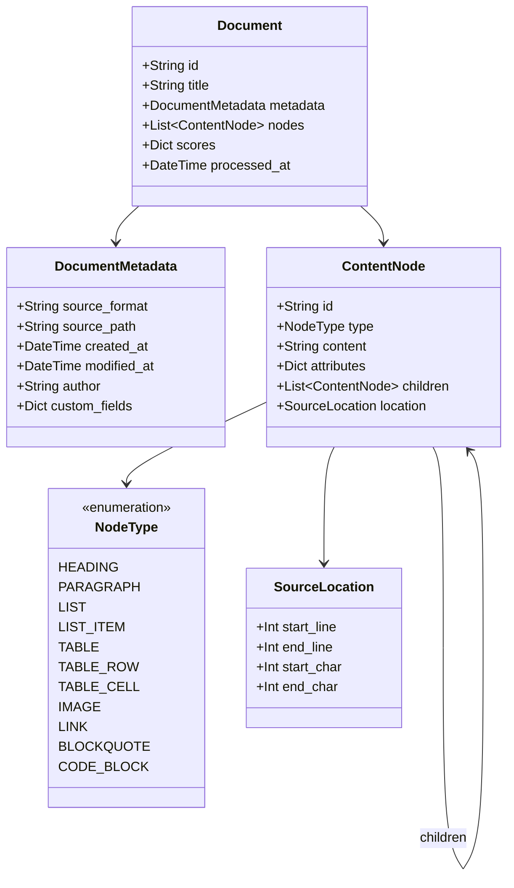
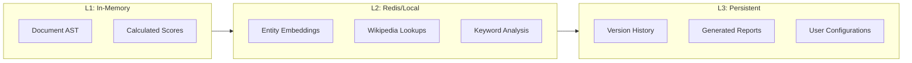
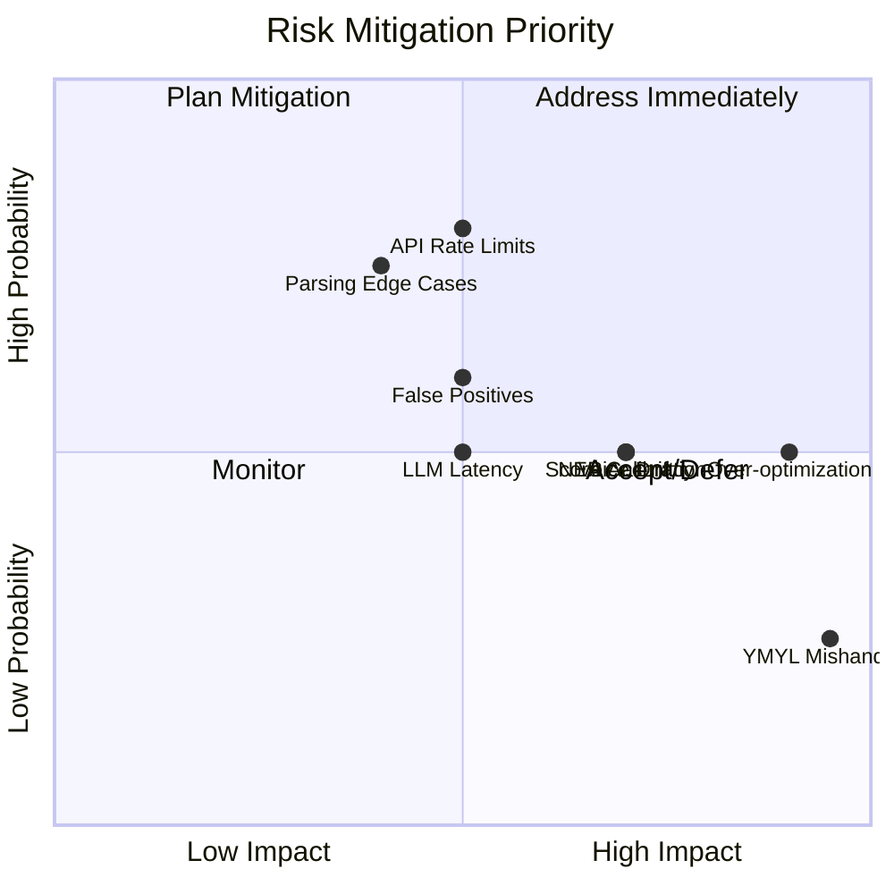

# Architecture Synthesis - SEO + AI Content Optimization Tool

## Executive Summary

This document synthesizes findings from seven comprehensive research topics to define the system architecture for an SEO + AI content optimization tool. The research phase produced over 800KB of technical documentation covering content ingestion, keyword strategy, on-page SEO, entity-based SEO, AI content extraction, scoring systems, and safety guardrails.

The proposed architecture follows a pipeline pattern with five major subsystems: **Ingestion**, **Analysis**, **Optimization**, **Guardrails**, and **Output**. Key architectural decisions include using a Pydantic-based Document AST for internal representation, a composite scoring system balancing SEO, readability, semantic completeness, and AI-readiness, and a multi-layer guardrail system preventing over-optimization and factual drift.

The system is designed for modularity, allowing components to be developed and tested independently while maintaining clear contracts between subsystems. Performance targets include sub-second processing for typical documents (<50KB) and 95%+ structure preservation accuracy.

---

## System Architecture Overview

### High-Level Architecture Diagram



### Component Responsibilities

| Subsystem | Component | Responsibility | Research Reference |
|-----------|-----------|----------------|-------------------|
| Ingestion | Format Parsers | Parse DOCX, HTML, MD, Google Docs | Topic A, Section 4 |
| Ingestion | Content Normalizer | Convert to unified AST representation | Topic A, Section 5 |
| Ingestion | Semantic Chunker | Split large documents intelligently | Topic A, Section 6 |
| Analysis | SEO Analyzer | Title, meta, headings, URLs, images | Topic C |
| Analysis | Keyword Engine | Intent, clustering, cannibalization | Topic B |
| Analysis | Entity Extractor | NER, entity linking, authority scoring | Topic D |
| Analysis | Readability Calculator | Flesch-Kincaid, SMOG, custom metrics | Topic F, Section 3 |
| Analysis | AI-Readiness Scorer | Structure, answer-ready, schema | Topic E, F |
| Analysis | Score Aggregator | Composite scoring with weights | Topic F, Section 6 |
| Optimization | Rule Engine | Apply optimization rules by priority | Topic C, Section 10 |
| Optimization | Suggestion Generator | Create actionable recommendations | Topic F, Section 9 |
| Optimization | Content Transformer | Apply approved changes | Topic C, E |
| Guardrails | Over-Optimization Detector | Keyword stuffing, unnatural phrasing | Topic G, Section 2 |
| Guardrails | Factual Preservation Checker | Entity/claim verification | Topic G, Section 3 |
| Guardrails | Brand Voice Validator | Style consistency enforcement | Topic G, Section 5 |
| Guardrails | Human Review Gateway | Approval workflow for flagged content | Topic G, Section 4 |
| Output | Report Generator | Markdown/HTML/PDF reports | Topic F, Section 9 |
| Output | Diff Viewer | Before/after comparison | Topic G, Section 7 |
| Output | Export Engine | Multiple output formats | Topic A |
| Output | API Endpoints | Programmatic access | All topics |

---

## Data Flow Architecture

### Primary Processing Pipeline



### Document AST Schema



---

## Cross-Cutting Concerns

### 1. Configuration Management

The system requires a layered configuration approach:

```yaml
# config/default.yaml
scoring:
  weights:
    seo_technical: 0.20
    content_quality: 0.20
    readability: 0.15
    semantic_completeness: 0.25
    ai_readiness: 0.20

  thresholds:
    poor: 0-30
    below_average: 31-50
    acceptable: 51-70
    good: 71-85
    optimized: 86-100

guardrails:
  keyword_density:
    warning: 0.025  # 2.5%
    reject: 0.04    # 4%

  factual_drift:
    max_allowed: 0.15  # 15% semantic drift
    auto_reject: 0.25  # 25% triggers rejection

  voice_similarity:
    min_threshold: 0.80

chunking:
  max_tokens: 8000
  overlap_ratio: 0.15
  semantic_threshold: 0.75

entity_extraction:
  model: "en_core_web_lg"
  confidence_threshold: 0.85
  link_to_wikidata: true
```

### 2. Error Handling Strategy

| Error Type | Handling Strategy | Recovery Action |
|------------|-------------------|-----------------|
| Parse Failure | Log + fallback to raw text | Continue with degraded analysis |
| External API Timeout | Retry with exponential backoff (3x) | Use cached/local fallback |
| Guardrail Rejection | Queue for human review | Hold changes until resolved |
| Score Calculation Error | Use partial scores with flag | Highlight incomplete analysis |
| Memory Limit Exceeded | Chunk document further | Process in streaming mode |

### 3. Performance Requirements

| Operation | Target Latency | Throughput |
|-----------|---------------|------------|
| Document parsing (<50KB) | <500ms | 100 docs/min |
| Full analysis pipeline | <3s | 20 docs/min |
| Entity extraction | <1s | 50 docs/min |
| Score calculation | <200ms | 300 docs/min |
| Report generation | <500ms | 100 docs/min |

### 4. Caching Strategy



**Cache TTLs:**
- Document AST: Session duration
- Calculated Scores: 1 hour
- Entity Embeddings: 24 hours
- Wikipedia Lookups: 7 days
- Keyword Analysis: 1 hour

### 5. Security Considerations

| Concern | Mitigation |
|---------|------------|
| PII in documents | Detect and mask before processing; GDPR compliance |
| API key exposure | Environment variables, secrets management |
| Malicious file uploads | Sandbox parsing, file type validation |
| LLM prompt injection | Input sanitization, output filtering |
| Data retention | Configurable retention policies, right to deletion |

---

## Recommended System Architecture

### Module Structure

```
seo-ai-optimizer/
├── src/
│   ├── __init__.py
│   ├── main.py                     # Application entry point
│   │
│   ├── ingestion/
│   │   ├── __init__.py
│   │   ├── parsers/
│   │   │   ├── docx_parser.py      # python-docx based
│   │   │   ├── html_parser.py      # trafilatura + beautifulsoup4
│   │   │   ├── markdown_parser.py  # mistune
│   │   │   └── gdocs_parser.py     # Google Docs API
│   │   ├── normalizer.py           # Convert to Document AST
│   │   ├── chunker.py              # Semantic chunking
│   │   └── models.py               # Pydantic Document models
│   │
│   ├── analysis/
│   │   ├── __init__.py
│   │   ├── seo/
│   │   │   ├── title_analyzer.py
│   │   │   ├── meta_analyzer.py
│   │   │   ├── heading_analyzer.py
│   │   │   ├── url_analyzer.py
│   │   │   ├── link_analyzer.py
│   │   │   └── image_analyzer.py
│   │   ├── keywords/
│   │   │   ├── intent_classifier.py
│   │   │   ├── keyword_clusterer.py
│   │   │   ├── cannibalization_detector.py
│   │   │   └── density_analyzer.py
│   │   ├── entities/
│   │   │   ├── ner_pipeline.py     # spaCy based
│   │   │   ├── entity_linker.py    # Wikidata integration
│   │   │   └── authority_scorer.py
│   │   ├── readability/
│   │   │   ├── flesch_kincaid.py
│   │   │   ├── smog.py
│   │   │   └── custom_metrics.py
│   │   ├── ai_readiness/
│   │   │   ├── structure_scorer.py
│   │   │   ├── answer_ready_scorer.py
│   │   │   └── schema_analyzer.py
│   │   └── aggregator.py           # Composite score calculation
│   │
│   ├── optimization/
│   │   ├── __init__.py
│   │   ├── rule_engine.py          # Apply optimization rules
│   │   ├── suggestion_generator.py # Create recommendations
│   │   └── transformer.py          # Apply content changes
│   │
│   ├── guardrails/
│   │   ├── __init__.py
│   │   ├── over_optimization.py    # Keyword stuffing detection
│   │   ├── factual_preservation.py # Claim/entity verification
│   │   ├── voice_validator.py      # Brand voice checking
│   │   ├── sensitivity.py          # YMYL detection
│   │   └── review_gateway.py       # Human review workflow
│   │
│   └── output/
│       ├── __init__.py
│       ├── report_generator.py     # Markdown/HTML/PDF
│       ├── diff_generator.py       # Before/after comparison
│       ├── exporters/
│       │   ├── docx_exporter.py
│       │   ├── html_exporter.py
│       │   └── markdown_exporter.py
│       └── api/                    # FastAPI endpoints
│           ├── routes.py
│           └── schemas.py
│
├── tests/
│   ├── unit/
│   ├── integration/
│   └── fixtures/
│
├── config/
│   ├── default.yaml
│   ├── development.yaml
│   └── production.yaml
│
├── docs/
│   ├── research/                   # Research documents (this phase)
│   └── specs/                      # Technical specifications
│
├── pyproject.toml
├── README.md
└── CLAUDE.md
```

### Technology Stack Summary

| Layer | Technology | Rationale |
|-------|------------|-----------|
| Language | Python 3.11+ | Rich NLP ecosystem, async support |
| Document Parsing | python-docx, trafilatura, mistune | Best-in-class for each format |
| NLP/NER | spaCy (en_core_web_lg) | Balance of speed and accuracy |
| Embeddings | sentence-transformers | Semantic similarity calculations |
| Data Validation | Pydantic v2 | Type safety, serialization |
| API Framework | FastAPI | Async, auto-documentation |
| Configuration | Dynaconf/Pydantic Settings | Layered config management |
| Testing | pytest, hypothesis | Unit + property-based testing |
| Caching | Redis (optional), in-memory | Performance optimization |

---

## Risk Assessment

### Technical Risks

| Risk | Probability | Impact | Mitigation |
|------|-------------|--------|------------|
| NER accuracy insufficient for SEO needs | Medium | High | Fine-tune on SEO-specific dataset; fallback to keyword matching |
| External API rate limits (Wikipedia/Wikidata) | High | Medium | Aggressive caching; local knowledge base fallback |
| LLM integration latency | Medium | Medium | Optional LLM; rule-based suggestions as primary |
| Document parsing edge cases | High | Medium | Comprehensive test suite; graceful degradation |
| Scoring calibration drift | Medium | High | Regular validation against ranking data; user feedback loop |

### Operational Risks

| Risk | Probability | Impact | Mitigation |
|------|-------------|--------|------------|
| Over-optimization damages content quality | Medium | Critical | Multi-layer guardrails; conservative defaults |
| False positives block valid optimizations | Medium | Medium | Tunable thresholds; easy human override |
| Brand voice drift in suggestions | Medium | High | Voice profile enforcement; human review triggers |
| YMYL content mishandling | Low | Critical | Sensitive content detection; mandatory review |

### Mitigation Priority Matrix



---

## Implementation Priority Matrix

### Phase 1: Core Pipeline (MVP)

| Priority | Component | Effort | Dependencies | Deliverable |
|----------|-----------|--------|--------------|-------------|
| P0 | Document AST models | Small | None | Pydantic models |
| P0 | DOCX parser | Medium | AST models | Working parser |
| P0 | HTML parser | Medium | AST models | Working parser |
| P0 | Markdown parser | Small | AST models | Working parser |
| P0 | Content normalizer | Medium | Parsers | Unified AST output |
| P1 | SEO analyzers (title, meta, headings) | Medium | Normalizer | Score components |
| P1 | Readability calculator | Small | Normalizer | Readability scores |
| P1 | Score aggregator | Small | Analyzers | Composite scores |
| P1 | Basic report generator | Medium | Aggregator | Markdown reports |

**MVP Exit Criteria:**
- Parse DOCX, HTML, Markdown to unified AST
- Generate SEO + readability scores
- Output basic report with recommendations

### Phase 2: Advanced Analysis

| Priority | Component | Effort | Dependencies | Deliverable |
|----------|-----------|--------|--------------|-------------|
| P1 | Keyword intent classifier | Medium | Normalizer | Intent tags |
| P1 | Keyword density analyzer | Small | Normalizer | Density metrics |
| P1 | Entity extractor (spaCy) | Medium | Normalizer | Entity list |
| P2 | Keyword clusterer | Large | Intent classifier | Topic clusters |
| P2 | Entity linker (Wikidata) | Large | Entity extractor | Linked entities |
| P2 | Cannibalization detector | Medium | Clusterer | Conflict report |
| P2 | AI-readiness scorer | Medium | Normalizer | AI score |

### Phase 3: Optimization Engine

| Priority | Component | Effort | Dependencies | Deliverable |
|----------|-----------|--------|--------------|-------------|
| P2 | Rule engine | Large | Analysis complete | Rule application |
| P2 | Suggestion generator | Medium | Rule engine | Recommendations |
| P3 | Content transformer | Large | Suggestions | Auto-optimization |
| P3 | LLM integration (optional) | Large | Transformer | AI suggestions |

### Phase 4: Guardrails & Safety

| Priority | Component | Effort | Dependencies | Deliverable |
|----------|-----------|--------|--------------|-------------|
| P2 | Over-optimization detector | Medium | Density analyzer | Warning system |
| P2 | Factual preservation checker | Large | Entity extractor | Verification |
| P3 | Brand voice validator | Large | Embeddings | Voice check |
| P3 | Human review gateway | Medium | All guardrails | Review workflow |
| P3 | Rollback mechanism | Medium | Version storage | Recovery system |

### Phase 5: Production Readiness

| Priority | Component | Effort | Dependencies | Deliverable |
|----------|-----------|--------|--------------|-------------|
| P3 | FastAPI endpoints | Medium | All components | REST API |
| P3 | Google Docs parser | Medium | API access | GDocs support |
| P3 | Advanced reporting | Medium | All analysis | Rich reports |
| P4 | Caching layer | Medium | Performance needs | Redis integration |
| P4 | Batch processing | Medium | Pipeline | Bulk operations |

---

## Key Decisions Summary

| Decision | Choice | Rationale | Alternatives Considered |
|----------|--------|-----------|------------------------|
| Internal representation | Pydantic Document AST | Type safety, validation, JSON-serializable | JSON-LD, Unified.js tree |
| DOCX parsing | python-docx | Most mature, best structure preservation | docx2python, mammoth |
| HTML extraction | trafilatura | 93.7% F1 score for content extraction | justext, readability-lxml |
| Markdown parsing | mistune | Fastest, extensible | markdown-it-py, marko |
| NER model | spaCy en_core_web_lg | 87% F1, 6000+ words/sec throughput | spaCy trf, BERT-NER |
| Embeddings | sentence-transformers | Local, no API dependency | OpenAI API, Cohere |
| Scoring approach | Composite weighted formula | Balances multiple factors, configurable | ML-learned weights |
| Chunking strategy | Semantic + heading-aware | Preserves context, respects structure | Fixed-size, sentence-level |
| Configuration | YAML + Pydantic | Human-readable, type-validated | JSON, TOML, .env |

---

## Open Questions for Stakeholder Review

### High Priority

1. **LLM Integration Scope**: Should the tool generate optimization suggestions using an LLM, or rely solely on rule-based recommendations?
   - LLM: Higher quality suggestions, but adds cost, latency, and complexity
   - Rules: Predictable, fast, but may miss nuanced improvements

2. **Real-time API Integration**: Should we integrate live data from SEMrush/Ahrefs for keyword difficulty and SERP analysis?
   - Pro: More accurate recommendations
   - Con: Additional cost, API dependencies, rate limits

3. **Deployment Model**: SaaS with managed infrastructure, or self-hosted/on-premise option?
   - Affects data privacy considerations, especially for enterprise clients

### Medium Priority

4. **Entity Knowledge Base**: Build local cache of Wikipedia/Wikidata, or rely on live API calls?
   - Local: Faster, offline capable, but requires updates
   - API: Always current, but rate-limited

5. **Scoring Weight Customization**: Allow users to adjust scoring weights, or enforce consistent methodology?
   - Customizable: Flexibility for different use cases
   - Fixed: Consistent, comparable scores across users

6. **Version Control Integration**: Should the tool integrate with Git for content versioning, or manage versions internally?

---

## Next Phase Recommendations

### Immediate Next Steps

1. **Create Technical Specifications** (`docs/specs/`)
   - Document AST schema specification
   - API contract definitions
   - Scoring formula specifications
   - Guardrail rule definitions

2. **Set Up Development Environment**
   - Initialize Python project with `uv`
   - Configure pre-commit hooks (ruff, mypy)
   - Set up pytest structure

3. **Implement MVP Components** (Phase 1)
   - Start with Document AST models
   - Build parsers in parallel
   - Create normalizer with test fixtures

4. **Establish Testing Strategy**
   - Collect sample documents (DOCX, HTML, MD)
   - Define golden test cases for each parser
   - Create scoring validation dataset

### Success Metrics for Implementation Phase

| Metric | Target | Measurement Method |
|--------|--------|-------------------|
| Parser accuracy | >95% structure preservation | Manual review of 100 documents |
| Processing speed | <3s for full pipeline | Automated benchmarks |
| Score reliability | Consistent within 5% on reprocess | Test-retest validation |
| User satisfaction | >80% find recommendations useful | User feedback survey |
| Guardrail precision | <10% false positives | Manual review of blocks |

---

## Document Version History

| Version | Date | Changes |
|---------|------|---------|
| 1.0 | 2026-01-16 | Initial synthesis from research phase |

---

*This document synthesizes findings from Topics A-G of the research phase. For detailed specifications on any component, refer to the corresponding research document in `docs/research/`.*
