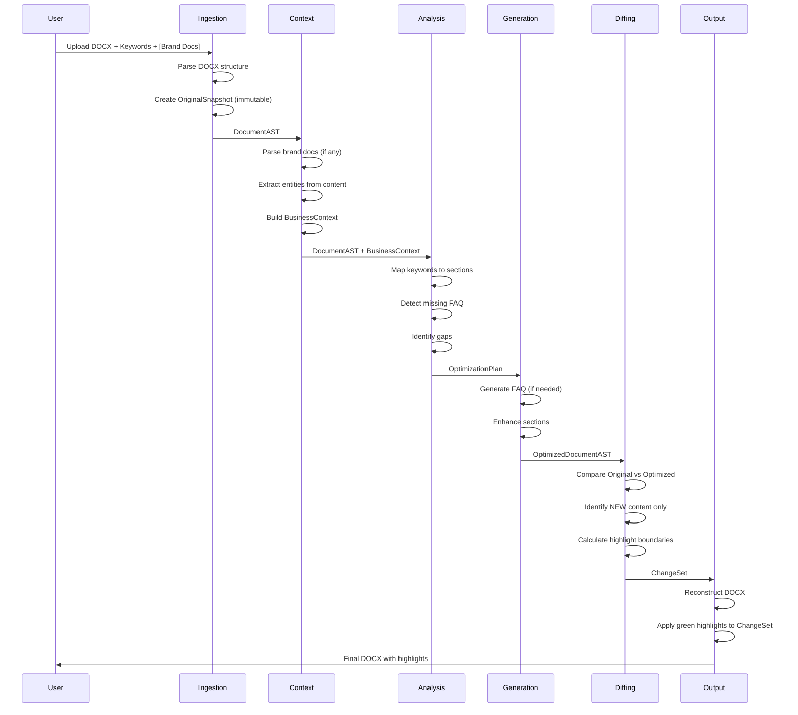

# System Overview - SEO + AI Content Optimizer

## Executive Summary

This document defines the architecture for a document-in, document-out SEO optimization tool. The tool accepts a DOCX file containing pre-extracted page content, target keywords, and optional brand context documents. It outputs a modified DOCX where all new content additions are highlighted in green, while original content remains unchanged.

The critical technical challenge is the **diffing and highlighting system**—users must trust that green highlighting indicates genuinely new content with zero false positives (existing content highlighted) and zero false negatives (new content not highlighted).

---

## System Architecture

### High-Level Data Flow

```
┌─────────────────────────────────────────────────────────────────────────────┐
│                              INPUT LAYER                                     │
├─────────────────────────────────────────────────────────────────────────────┤
│                                                                              │
│  ┌──────────────┐    ┌──────────────┐    ┌──────────────┐                   │
│  │  Source DOCX │    │   Keywords   │    │ Brand Docs   │                   │
│  │  (Required)  │    │  (Required)  │    │  (Optional)  │                   │
│  └──────┬───────┘    └──────┬───────┘    └──────┬───────┘                   │
│         │                   │                   │                            │
└─────────┼───────────────────┼───────────────────┼────────────────────────────┘
          │                   │                   │
          ▼                   ▼                   ▼
┌─────────────────────────────────────────────────────────────────────────────┐
│                           PROCESSING LAYER                                   │
├─────────────────────────────────────────────────────────────────────────────┤
│                                                                              │
│  ┌────────────────────────────────────────────────────────────────────────┐ │
│  │ 1. INGESTION                                                           │ │
│  │    ├── Parse DOCX structure (headings, paragraphs, lists, tables)     │ │
│  │    ├── Extract text with position mapping                              │ │
│  │    ├── Preserve formatting metadata                                    │ │
│  │    └── Output: DocumentAST + OriginalSnapshot                          │ │
│  └────────────────────────────────────────────────────────────────────────┘ │
│                                    │                                         │
│                                    ▼                                         │
│  ┌────────────────────────────────────────────────────────────────────────┐ │
│  │ 2. CONTEXT BUILDING                                                    │ │
│  │    ├── Parse brand documents (if provided)                             │ │
│  │    ├── Extract business entities from source content                   │ │
│  │    ├── Build business context model                                    │ │
│  │    └── Output: BusinessContext                                         │ │
│  └────────────────────────────────────────────────────────────────────────┘ │
│                                    │                                         │
│                                    ▼                                         │
│  ┌────────────────────────────────────────────────────────────────────────┐ │
│  │ 3. ANALYSIS                                                            │ │
│  │    ├── Map keywords to content sections                                │ │
│  │    ├── Identify optimization opportunities                             │ │
│  │    ├── Detect missing FAQ section                                      │ │
│  │    ├── Score current SEO readiness                                     │ │
│  │    └── Output: OptimizationPlan                                        │ │
│  └────────────────────────────────────────────────────────────────────────┘ │
│                                    │                                         │
│                                    ▼                                         │
│  ┌────────────────────────────────────────────────────────────────────────┐ │
│  │ 4. GENERATION                                                          │ │
│  │    ├── Generate FAQ section (if missing)                               │ │
│  │    ├── Enhance existing sections (expanded copy)                       │ │
│  │    ├── Add meta improvements (titles, descriptions)                    │ │
│  │    └── Output: OptimizedDocumentAST                                    │ │
│  └────────────────────────────────────────────────────────────────────────┘ │
│                                    │                                         │
│                                    ▼                                         │
│  ┌────────────────────────────────────────────────────────────────────────┐ │
│  │ 5. DIFFING (CRITICAL)                                                  │ │
│  │    ├── Compare OriginalSnapshot vs OptimizedDocumentAST                │ │
│  │    ├── Identify genuinely NEW content (character-level)                │ │
│  │    ├── Handle edge cases (rewording, expansion, movement)              │ │
│  │    └── Output: ChangeSet with precise highlight boundaries             │ │
│  └────────────────────────────────────────────────────────────────────────┘ │
│                                    │                                         │
│                                    ▼                                         │
│  ┌────────────────────────────────────────────────────────────────────────┐ │
│  │ 6. OUTPUT GENERATION                                                   │ │
│  │    ├── Reconstruct DOCX with original formatting                       │ │
│  │    ├── Apply green highlighting ONLY to ChangeSet items                │ │
│  │    ├── Preserve all original content unchanged                         │ │
│  │    └── Output: Final DOCX                                              │ │
│  └────────────────────────────────────────────────────────────────────────┘ │
│                                                                              │
└─────────────────────────────────────────────────────────────────────────────┘
                                    │
                                    ▼
┌─────────────────────────────────────────────────────────────────────────────┐
│                              OUTPUT LAYER                                    │
├─────────────────────────────────────────────────────────────────────────────┤
│                                                                              │
│  ┌──────────────────────────────────────────────────────────────────────┐   │
│  │                        OPTIMIZED DOCX                                 │   │
│  │  ┌────────────────────────────────────────────────────────────────┐  │   │
│  │  │ Original content (unchanged formatting, no highlights)         │  │   │
│  │  └────────────────────────────────────────────────────────────────┘  │   │
│  │  ┌────────────────────────────────────────────────────────────────┐  │   │
│  │  │ NEW content (GREEN HIGHLIGHT)                                  │  │   │
│  │  └────────────────────────────────────────────────────────────────┘  │   │
│  └──────────────────────────────────────────────────────────────────────┘   │
│                                                                              │
│  + Optional: Changes summary report (what was added, where)                  │
│                                                                              │
└─────────────────────────────────────────────────────────────────────────────┘
```

---

## Component Responsibilities

| Component | Module | Input | Output | Critical? |
|-----------|--------|-------|--------|-----------|
| DOCX Parser | `src/ingestion/` | DOCX file | DocumentAST + OriginalSnapshot | Medium |
| Context Builder | `src/context/` | Brand docs + Source content | BusinessContext | Low |
| Analyzer | `src/analysis/` | DocumentAST + Keywords + Context | OptimizationPlan | Medium |
| Generator | `src/generation/` | OptimizationPlan + Context | OptimizedDocumentAST | Medium |
| Differ | `src/diffing/` | Original vs Optimized | ChangeSet | **CRITICAL** |
| Output Builder | `src/output/` | OptimizedAST + ChangeSet | Final DOCX | High |

---

## Critical Path Analysis

### The Diffing Problem

The entire tool's value proposition depends on accurate change detection:

```
User Trust Equation:
────────────────────
IF green highlighting is accurate THEN tool is useful
IF green highlighting has errors THEN tool is worthless

Accuracy Requirements:
├── Zero false positives: Never highlight existing content
├── Zero false negatives: Never miss new content
└── Semantic awareness: Rewording ≠ new content
```

### Failure Mode Analysis

| Failure Mode | User Impact | Severity |
|--------------|-------------|----------|
| Highlight existing content | User wastes time reviewing unchanged text | Critical |
| Miss highlighting new content | User misses important additions | Critical |
| Highlight reworded content | User confused about what's "new" | High |
| Incorrect highlight boundaries | Partial highlights confuse users | Medium |
| Corrupt original formatting | Document looks broken | High |

### Risk Mitigation

1. **Extensive test suite for diffing** (50+ test cases minimum)
2. **Conservative highlighting** (when uncertain, don't highlight)
3. **Human review trigger** for low-confidence diffs
4. **Before/after preview** before committing output

---

## Data Structures

### Core Models

```python
# Simplified conceptual models (not implementation code)

class DocumentAST:
    """Internal representation of document structure"""
    id: str
    nodes: List[ContentNode]
    metadata: DocumentMetadata

class ContentNode:
    """Single element in document"""
    id: str
    type: NodeType  # HEADING, PARAGRAPH, LIST, TABLE, etc.
    content: str
    formatting: FormattingInfo
    position: PositionInfo
    children: List[ContentNode]

class OriginalSnapshot:
    """Immutable record of original content for diffing"""
    document_hash: str
    text_by_position: Dict[str, str]  # position_id -> original text
    structure_fingerprint: str

class ChangeSet:
    """Precise record of what content is new"""
    additions: List[Addition]

class Addition:
    """Single new content segment to highlight"""
    node_id: str
    start_char: int
    end_char: int
    content: str
    confidence: float  # How confident we are this is genuinely new
```

---

## Module Directory Structure

```
src/
├── __init__.py
├── main.py                      # Entry point
│
├── ingestion/
│   ├── __init__.py
│   ├── docx_parser.py           # DOCX parsing with structure preservation
│   ├── models.py                # DocumentAST, ContentNode, etc.
│   └── snapshot.py              # OriginalSnapshot creation
│
├── context/
│   ├── __init__.py
│   ├── brand_parser.py          # Parse brand documents
│   ├── entity_extractor.py      # Extract business entities
│   └── context_builder.py       # Build BusinessContext model
│
├── analysis/
│   ├── __init__.py
│   ├── keyword_mapper.py        # Map keywords to content
│   ├── gap_detector.py          # Find optimization opportunities
│   ├── faq_detector.py          # Detect if FAQ exists
│   └── plan_builder.py          # Create OptimizationPlan
│
├── generation/
│   ├── __init__.py
│   ├── faq_generator.py         # Generate FAQ section
│   ├── content_enhancer.py      # Enhance existing sections
│   └── meta_optimizer.py        # Titles, descriptions
│
├── diffing/                     # CRITICAL MODULE
│   ├── __init__.py
│   ├── differ.py                # Main diff algorithm
│   ├── semantic_matcher.py      # Detect rewording vs new content
│   ├── boundary_finder.py       # Find exact highlight boundaries
│   └── confidence_scorer.py     # Rate confidence of diff results
│
└── output/
    ├── __init__.py
    ├── docx_builder.py          # Reconstruct DOCX
    ├── highlighter.py           # Apply green highlighting
    └── report_generator.py      # Optional changes summary
```

---

## Processing Pipeline (Sequence)



---

## Technology Decisions

| Component | Technology | Rationale |
|-----------|------------|-----------|
| DOCX Parsing | `python-docx` | Standard library, good structure access |
| Text Diffing | `diff-match-patch` | Character-level precision, handles edge cases |
| Semantic Matching | `sentence-transformers` | Detect rewording via embeddings |
| NLP/Entities | `spaCy en_core_web_lg` | Business entity extraction |
| Highlighting | `python-docx` run formatting | Native DOCX highlighting support |
| Configuration | `Pydantic` | Type-safe settings |

---

## Success Criteria

### MVP Definition

| Feature | Required for MVP? | Notes |
|---------|-------------------|-------|
| DOCX parsing with structure | Yes | Core functionality |
| Keyword-to-content mapping | Yes | Basic analysis |
| FAQ generation (if missing) | Yes | Key feature |
| Precise diffing/highlighting | Yes | Critical path |
| DOCX output with highlights | Yes | Core output |
| Brand context (optional input) | Yes | Accept but can ignore |
| Content enhancement beyond FAQ | No | Phase 2 |
| Changes summary report | No | Nice to have |

### Acceptance Criteria

1. **Highlighting Accuracy**
   - 0% false positive rate (existing content never highlighted)
   - 0% false negative rate (new content always highlighted)
   - Tested against 50+ edge case scenarios

2. **Structure Preservation**
   - Output DOCX maintains original heading hierarchy
   - Original formatting (bold, italic, fonts) unchanged
   - Images and tables preserved

3. **FAQ Quality**
   - Generated FAQs are contextually relevant
   - Questions address likely user queries
   - Answers are accurate (no hallucination)

4. **Cross-Platform Compatibility**
   - Output opens correctly in Microsoft Word
   - Output opens correctly in Google Docs
   - Output opens correctly in LibreOffice

---

## Open Questions

1. **Semantic equivalence threshold**: At what embedding similarity do we consider text "the same" vs "new"?
2. **Partial expansion handling**: If "The product helps users" becomes "The product helps users save time", how do we highlight only "save time"?
3. **Moved content detection**: How do we detect that a paragraph was moved vs. deleted + new paragraph added?
4. **LLM integration**: Should FAQ generation use an LLM API, or rule-based generation?

---

## Document References

| Section | Document | Content |
|---------|----------|---------|
| 1 | `01-docx-parsing.md` | DOCX parsing specification |
| 2 | `02-keyword-optimization.md` | Keyword analysis rules |
| 3 | `03-business-context.md` | Context inference logic |
| 4 | `04-faq-generation.md` | FAQ generation engine |
| 5 | `05-diffing-highlighting.md` | **CRITICAL** Diffing algorithm |
| 6 | `06-docx-output.md` | Output generation |
| 7 | `07-guardrails.md` | Safety checks |

---

*Document Version: 2.0 (Revised Scope)*
*Created: 2026-01-16*
